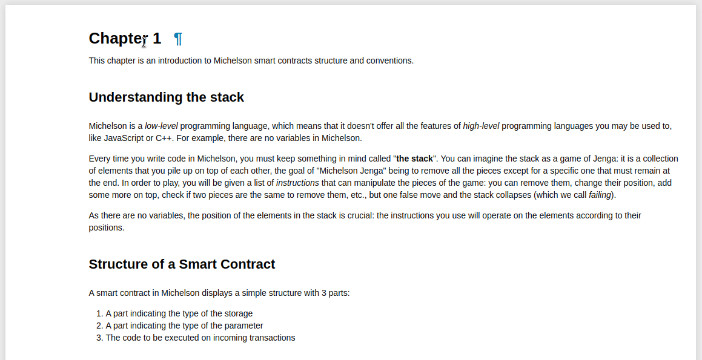

# Michelson Labs



Series of Jupyter notebooks for learning the Tezos native contract language.

## Run notebooks

Clone this repo and cd in, then:

```
docker pull bakingbad/michelson-kernel
docker run --rm -it -p 127.0.0.1:8888:8888 -v $(pwd):/home/jupyter/notebooks bakingbad/michelson-kernel
```

or just 

```
make run
```

## Contribute

Fist of all, make sure all dependencies are installed:
```
make install
```

If you are editing notebooks, you need to save & render them afterwards:
```
make docs
```

Run the site in the development mode:
```
make dev
```

## Contact us

If you have any questions regarding the tutorials, Michelson kernel, or you spotted a bug — please reach us:
* Telegram [https://t.me/baking_bad_chat](https://t.me/baking_bad_chat)
* Slack [https://tezos-dev.slack.com/archives/CV5NX7F2L](https://tezos-dev.slack.com/archives/CV5NX7F2L)
* Discord [Baking Bad](https://discord.gg/RcPGSdcVSx)


## About

Project is supported by Tezos Foundation.  

Michelson tutorials: [Claude Barde](https://twitter.com/claudebarde)  
Jupyter kernel & educational platform: [Baking Bad](https://twitter.com/TezosBakingBad)