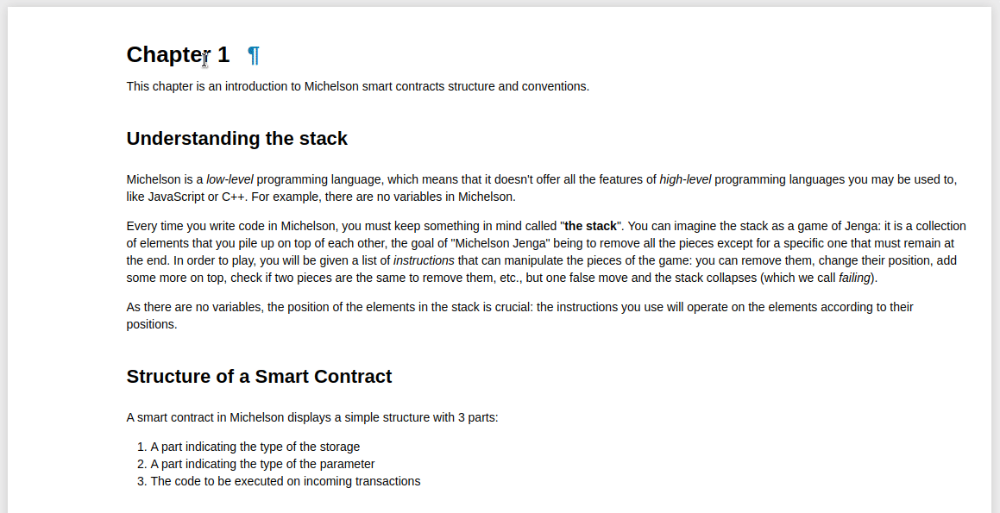

# Introduction
Before we move on to the first chapter, here are two things you should know:
* Installation options;
* How a notebook is structured.

## Try online
In order to feel what interactive notebooks are you can open course chapters in the Binder service, that provides a temporary Jupyter environment.


::: warning NOTE
Your changes won't be saved unless you download the notebook to your computer.  
For regular use consider local setup (options below).
:::

## Run in Docker

Ensure you have [Docker](https://docs.docker.com/get-docker/) installed.

```
docker pull bakingbad/michelson-kernel
docker run --rm -it -p 127.0.0.1:8888:8888 -v $(pwd):/home/jupyter/notebooks bakingbad/michelson-kernel
```

Open _http://127.0.0.1:8888_ in your browser.  

Note, that the _notebooks_ folder is mounted to your local filesystem by default, so you won't loose any changes made.

## Install Jupyter

First of all, install several crypto libraries:
* Ubuntu: `sudo apt install libsodium-dev libsecp256k1-dev libgmp-dev`
* MacOS: `brew install libsodium libsecp256k1 gmp`
* Windows: follow the [guide](https://github.com/baking-bad/pytezos#windows)

Ensure you have a suitable Python version (3.5+). 
The recomended way is [pyenv](https://github.com/pyenv/pyenv-installer).
Make sure you have installed all the [dependencies](https://github.com/pyenv/pyenv/wiki/Common-build-problems) first.

```
pip install jupyter michelson-kernel
jupyter notebook
```

Open the link from the command output, create new notebook with Michelson kernel.

## Notebook workflow

A notebook is a set of cells that can contain text (markdown), executable code, and the result of an execution.



The code is executed using a special extension called the kernel. Michelson kernel is actually a wrapped interpreter that supports an extended instruction set: in addition to the language primitives it also expands Michelson macros and special debugging [helpers](/chapters/99).

### Code block
This is a cell holding a Michelson expression that can be executed. Keep in mind, that all cells share the state, so the order of execution does matter.

```Michelson
PUSH string "Hello" ;
```

### Execution log
By default verbose logging is enabled and you will see a step-by-step instruction execution.

<div class="stdout">
    <pre><span class="stream-name">stdout</span><br/>PUSH: push Hello;</pre>
</div>

### Errors
In case of a runtime error you will see a red box with the message and traceback.

<div class="stderr">
    <pre><span class="stream-name">stderr</span><br/>MichelsonRuntimeError</pre>
</div>

### Stack values
If a stack entry occurs as a result of the execution, you will see the value, its type, and name (if any).

<div class="embedded-html">
<table>
<thead>
<tr><th>value                                             </th><th>type                                       </th></tr>
</thead>
<tbody>
<tr><td><pre style="text-align: left;">"Hello"</pre></td><td><pre style="text-align: left;">string</pre></td></tr>
</tbody>
</table>
</div>

### Helpers and macros
You will notice that different primitives are painted in different colors. The kernel distinguishes between standard language instructions, [macros](https://tezos.gitlab.io/whitedoc/michelson.html#macros) (not part of the specification), and [helpers](/chapters/99) that do not work outside the Jupyter environment.

```Michelson
DROP ;  ## Michelson instruction
FAIL ;  ## Michelson macro
DUMP ;  ## Jupyter kernel helper
```
