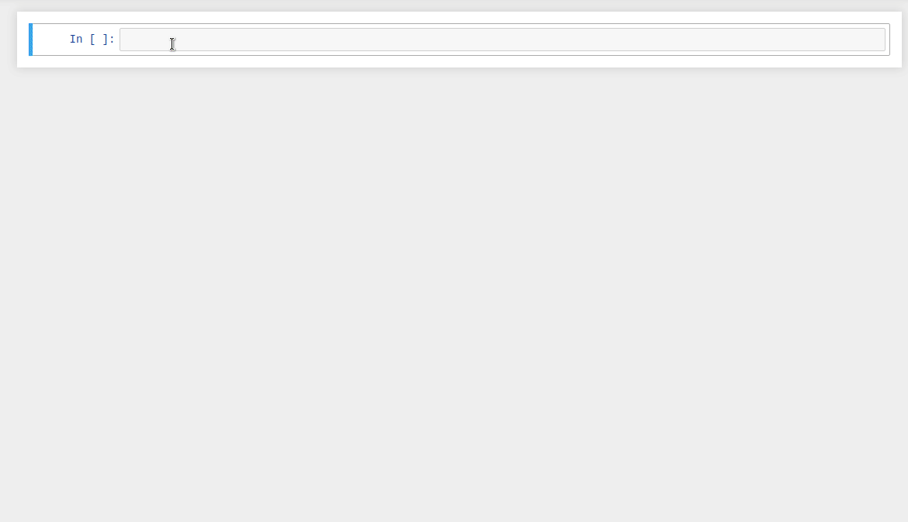

# Learn Michelson
Welcome to the interactive Michelson learning course!   

It consists of a series of [Jupyter notebooks](https://jupyter.org/) covering all aspects of the language as well as some patterns of smart contract development. Code snippets from the notebooks can be executed both online and locally. Also, you can write code yourself — there are exercises at the end of several tutorials for self-evaluation.  

## Why 🤔
Here are several reasons why learning Michelson might be a good idea:
* You are new to smart contract development and willing to do it right, starting from the very basics (laudably!);
* You are already a Tezos DApp developer and desire to go deeper in order to learn how to write a more optimized code in high-level languages (that are compiled down to Michelson);
* You are a Tezos ecosystem developer and need to upgrade your skills for better understanding what's happening under the hood and/or implementing some Michelson-related tools.

#### Michelson is not just another compilation target
It is strikingly different from the low-level bytecode, providing a rich system of safe types, as well as the ability to attach metadata to describe data structures and name stack variables.  

In fact, most of the containers used in high-level languages are directly bound to the Michelson primitives (currently). Basically, there are three main issues that HL languages do solve:
* It's hard to write complex contracts in a stack-based language, variables are much more convenient;
* There's no native records/tuples (but there will be!) and working with nested structures is tough;
* It's not possible to split code over logical blocks and/or files.

On the other hand, manual control allows you to write perfectly optimized code that consumes less gas.

#### Pure Michelson contracts are used in production
Michelson perfectly suits for writing small pieces of business logic. Here are some examples:
* [Generic multisig](https://github.com/murbard/smart-contracts/blob/master/multisig/michelson/generic.tz) — fomally verified, integrated into Tezos-client;
* [Spending limit contract](https://blog.nomadic-labs.com/cortez-security-by-using-the-spending-limit-contract.html) — fomally verified, integrated into Cortez wallet;
* [Vesting contract](https://better-call.dev/mainnet/KT1PDAELuX7CypUHinUgFgGFskKs7ytwh5Vw/operations) — fomally verified, handles millions of tez;
* [Atomex](https://better-call.dev/mainnet/KT1VG2WtYdSWz5E7chTeAdDPZNy2MpP8pTfL/operations) — an operating cross-chain DEX;
* [Bakers registry](https://better-call.dev/mainnet/KT1ChNsEFxwyCbJyWGSL3KdjeXE28AY1Kaog/operations) — a decentralized approach to handling public validators' data;

## How 
As already mentioned, our course is based on interactive notebooks, a tool that is designed to solve some of the problems when writing contracts in Michelson.

In particular it helps to visualize and understand stack transformations, and to split code across several cells/steps.  

Our course consists of chapters each of which is dedicated to a specific topic. Each chapter contains step-by-step code samples accompanied by explanatory comments, as well as some elements from the CS program needed for better understanding. The course materials can be used in many ways:
* The [renderred version](/introduction.html) is essentially a verbose Michelson documentation, complementary to other resources;
* [Notebooks](https://github.com/baking-bad/michelson-labs) are available for self-paced study: read and execute chapters one by one, do exercises for self-evaluation;
* We also plan to host online training sessions in collaboration with Tezos community entities. Follow the updates in our [Twitter channel](https://twitter.com/tezosbakingbad).

## Resources
Here are some useful links that will complement your knowledge:
* Michelson reference [https://michelson.nomadic-labs.com/](https://michelson.nomadic-labs.com/)
* Michelson specification [https://tezos.gitlab.io/whitedoc/michelson.html](https://tezos.gitlab.io/whitedoc/michelson.html)
* TQ wiki [https://learn.tqtezos.com/files/language.html](https://learn.tqtezos.com/files/language.html)
* Michelson Slack channel [https://tezos-dev.slack.com/archives/C69RKF3PG](https://tezos-dev.slack.com/archives/C69RKF3PG)
* Michelson playground [https://try-michelson.tzalpha.net/](https://try-michelson.tzalpha.net/)
* Jupyter kernel [https://github.com/baking-bad/michelson-kernel](https://github.com/baking-bad/michelson-kernel)

Introduction to Michelson by Claude Barde:
* [Part 1](https://medium.com/better-programming/introduction-to-michelson-the-language-of-tezos-part-1-374c03394cc3)
* [Part 2](https://medium.com/better-programming/an-introduction-to-michelson-the-scripting-language-of-tezos-part-2-4cc972c8237c)
* [Part 3](https://medium.com/coinmonks/an-introduction-to-michelson-the-scripting-language-of-tezos-part-3-70bb294cd19e)

## Contact us
If you have any questions regarding the tutorials, Michelson kernel, or you spotted a bug — please reach us:
* Telegram [https://t.me/baking_bad_chat](https://t.me/baking_bad_chat)
* Slack [https://tezos-dev.slack.com/archives/CV5NX7F2L](https://tezos-dev.slack.com/archives/CV5NX7F2L)
* Email [hello@baking-bad.org](mailto://hello@baking-bad.org)

## About

This is the first part of an educational project called **Tezos Labs**, supported by [Tezos Foundation](https://tezos.foundation). 

*Michelson tutorials: [Claude Barde](https://twitter.com/claudebarde)*  
*Jupyter kernel & education platform: [Baking Bad](https://baking-bad.org/docs)*