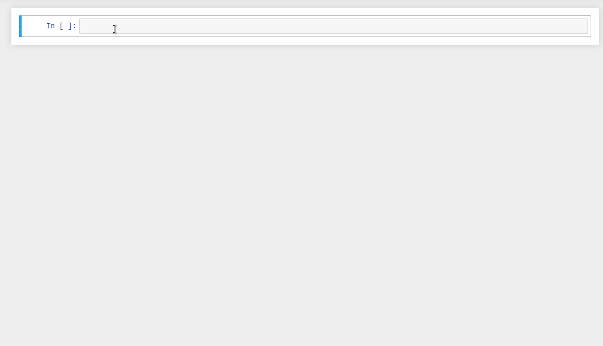

# Michelson language

Welcome to the first part of the Tezos Labs project, dedicated to the Tezos native smart contract language — Michelson.

## Why 🤔
Here are several reasons why learning Michelson might be a good idea:
* You are new to smart contract development and willing to do it right, starting from the very basics (laudably!);
* You are already a Tezos DApp developer and desire to go deeper in order to learn how to write a more optimized code in high-level languages (that are compiled down to Michelson);
* You are a Tezos ecosystem developer and need to upgrade your skills for better understanding what's happening under the hood and/or implementing some Michelson-related tools.

#### Michelson is not just another compilation target
It is strikingly different from the low-level bytecode, providing a rich system of safe types, as well as the ability to attach metadata to describe data structures and name stack variables.  

In fact, most of the containers used in high-level languages are directly bound to the Michelson primitives (currently). Basically, there are three main issues that HL languages do solve:
* It's hard to write complex contracts in a stack-based language, variables are much more convenient;
* There's no native records/tuples (but there will be!) and working with nested structures is tough;
* It's not possible to split code over logical blocks and/or files.

On the other hand, manual control allows you to write perfectly optimized code that consumes less gas.

#### Pure Michelson contracts are used in production
Michelson perfectly suits for writing small pieces of business logic. Here are some examples:
* [Generic multisig](https://github.com/murbard/smart-contracts/blob/master/multisig/michelson/generic.tz) — fomally verified, integrated into Tezos-client;
* [Spending limit contract](https://blog.nomadic-labs.com/cortez-security-by-using-the-spending-limit-contract.html) — fomally verified, integrated into Cortez wallet;
* [Vesting contract](https://better-call.dev/mainnet/KT1PDAELuX7CypUHinUgFgGFskKs7ytwh5Vw/operations) — fomally verified, handles millions of tez;
* [Atomex](https://better-call.dev/mainnet/KT1VG2WtYdSWz5E7chTeAdDPZNy2MpP8pTfL/operations) — an operating cross-chain DEX;
* [Bakers registry](https://better-call.dev/mainnet/KT1ChNsEFxwyCbJyWGSL3KdjeXE28AY1Kaog/operations) — a decentralized approach to handling public validators' data;

## How 
As already mentioned, our course is based on interactive notebooks, a tool that is designed to solve some of the problems when writing contracts in Michelson.



In particular it helps to visualize and understand stack transformations, and to split code across several cells/steps.  

Our course consists of chapters each of which is dedicated to a specific topic. Each chapter contains step-by-step code samples accompanied by explanatory comments, as well as some elements from the CS program needed for better understanding. The course materials can be used in many ways:
* The [renderred version](/introduction.html) is essentially a verbose Michelson documentation, complementary to other resources;
* [Notebooks](https://github.com/baking-bad/michelson-labs) are available for self-paced study: read and execute chapters one by one, do exercises for self-evaluation;
* We also plan to host online training sessions in collaboration with Tezos community entities. Follow the updates in our [Twitter channel](https://twitter.com/tezosbakingbad).

## Workflow

A notebook is a set of cells that can contain text (markdown), executable code, and the result of an execution.


The code is executed using a special extension called the kernel. Michelson kernel is actually a wrapped interpreter that supports an extended instruction set: in addition to the language primitives it also expands Michelson macros and special debugging [helpers](/chapters/99).

### Code block
This is a cell holding a Michelson expression that can be executed. Keep in mind, that all cells share the state, so the order of execution does matter.

```Michelson
PUSH string "Hello" ;
```

### Execution log
By default verbose logging is enabled and you will see a step-by-step instruction execution.

<div class="stdout">
    <pre><span class="stream-name">stdout</span><br/>PUSH: push Hello;</pre>
</div>

### Errors
In case of a runtime error you will see a red box with the message and traceback.

<div class="stderr">
    <pre><span class="stream-name">stderr</span><br/>MichelsonRuntimeError</pre>
</div>

### Stack values
If a stack entry occurs as a result of the execution, you will see the value, its type, and name (if any).

<div class="embedded-html">
<table>
<thead>
<tr><th>value                                             </th><th>type                                       </th></tr>
</thead>
<tbody>
<tr><td><pre style="text-align: left;">"Hello"</pre></td><td><pre style="text-align: left;">string</pre></td></tr>
</tbody>
</table>
</div>

### Helpers and macros
You will notice that different primitives are painted in different colors. The kernel distinguishes between standard language instructions, [macros](https://tezos.gitlab.io/whitedoc/michelson.html#macros) (not part of the specification), and [helpers](/chapters/99) that do not work outside the Jupyter environment.

```Michelson
DROP ;  ## Michelson instruction
FAIL ;  ## Michelson macro
DUMP ;  ## Jupyter kernel helper
```

## Resources

Here are some useful links that will complement your knowledge:
* Michelson reference [https://michelson.nomadic-labs.com/](https://michelson.nomadic-labs.com/)
* Michelson specification [https://tezos.gitlab.io/whitedoc/michelson.html](https://tezos.gitlab.io/whitedoc/michelson.html)
* TQ wiki [https://learn.tqtezos.com/files/language.html](https://learn.tqtezos.com/files/language.html)
* Michelson Slack channel [https://tezos-dev.slack.com/archives/C69RKF3PG](https://tezos-dev.slack.com/archives/C69RKF3PG)
* Michelson playground [https://try-michelson.tzalpha.net/](https://try-michelson.tzalpha.net/)
* Jupyter kernel [https://github.com/baking-bad/michelson-kernel](https://github.com/baking-bad/michelson-kernel)

Introduction to Michelson by Claude Barde:
* [Part 1](https://medium.com/better-programming/introduction-to-michelson-the-language-of-tezos-part-1-374c03394cc3)
* [Part 2](https://medium.com/better-programming/an-introduction-to-michelson-the-scripting-language-of-tezos-part-2-4cc972c8237c)
* [Part 3](https://medium.com/coinmonks/an-introduction-to-michelson-the-scripting-language-of-tezos-part-3-70bb294cd19e)
